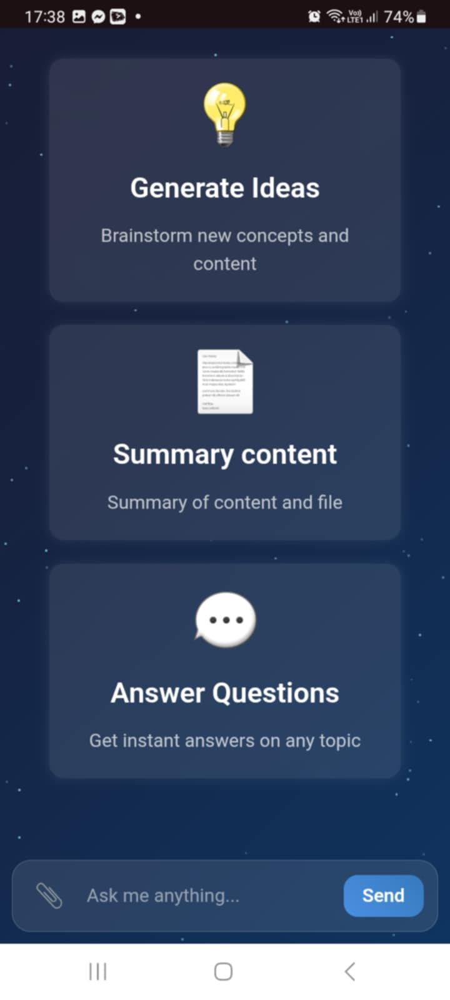

 <h1 align="center">Multi agent system</h1>

## Introduction

Here is my python source code for Multi agent LLMs system:

1: First agent is memory_chat: this agent have memory, it can chat and still remember what happened before  
2: Second agent is summery_pdf: this agent can summarize file PDF and chat about informations in the file  
3: Third agent is SearchTool: this agent can search internet and get knowledge latest  
4: Manager agent is ai_agent_router: this agent will classification user's question and call child agent for answer  
5: Run a Web applications that are publicly accessible via domain name or IP 
6: Deploy on AWS free (EC2) with FastAPI. 

## Web app

   
  <i>Web app demo</i>

## Test

   
  <i>UI</i>

<table align="center">
  <tr>
    <td align="center" width="25%">
       
    </td>
    <td align="center" width="25%">
       
    </td>
    <td align="center" width="25%">
       
    </td>
    <td align="center" width="25%">
       
    </td>
  </tr>
</table>

<em>Test on mobile</em>

## Source code guide
     1: Create API key
          Visit website https://groq.com/
          Create API key 
          bash: touch .env
          patse: GROQ_API_KEY=<API key>
     2: Clone repo
          !git clone https://github.com/Tung003/Multi_agent.git
     3: Install libs
          !pip install -r requirements.txt
     4: Run 
          multi_agent_api.py
## Build docker image
     1: Build docker image
          !docker build -t <name_image> .   
     2: Run docker image
          !docker run -p 8000:8000 -e GROQ_API_KEY=<API_key> <name_image>
